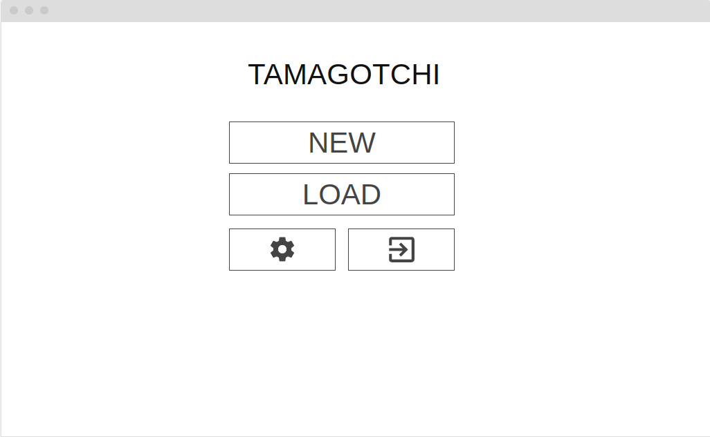
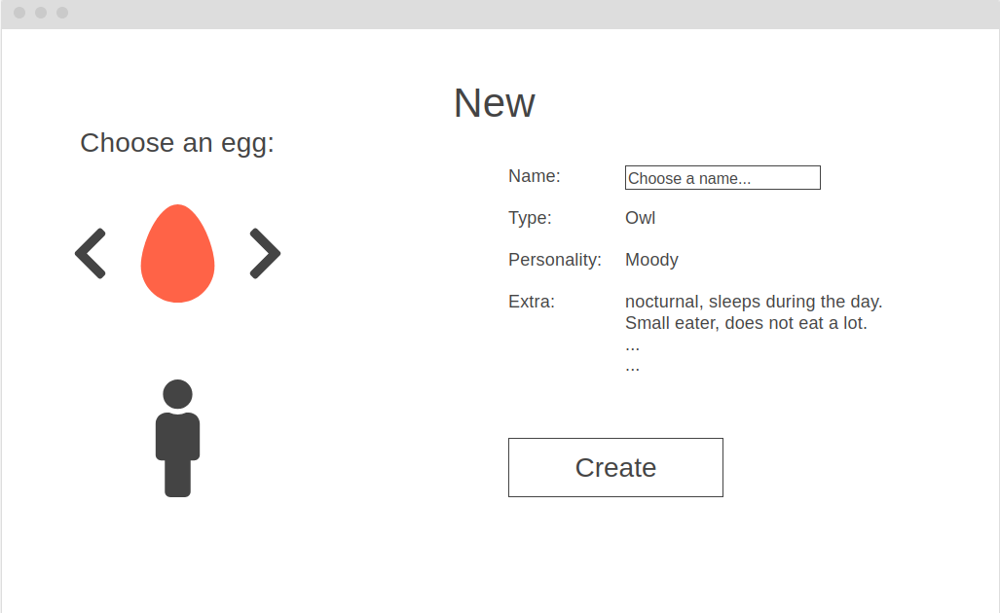
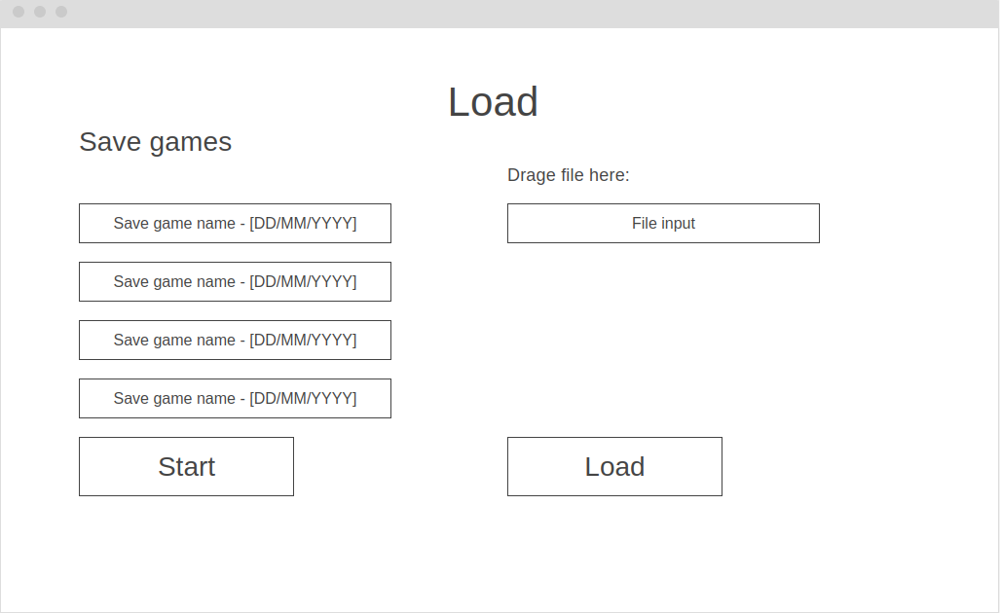
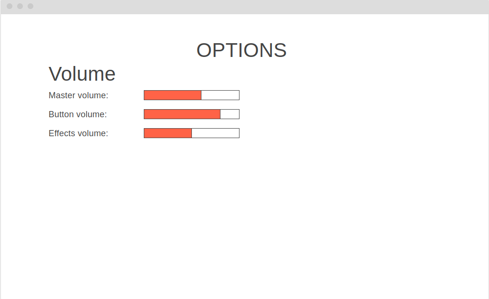
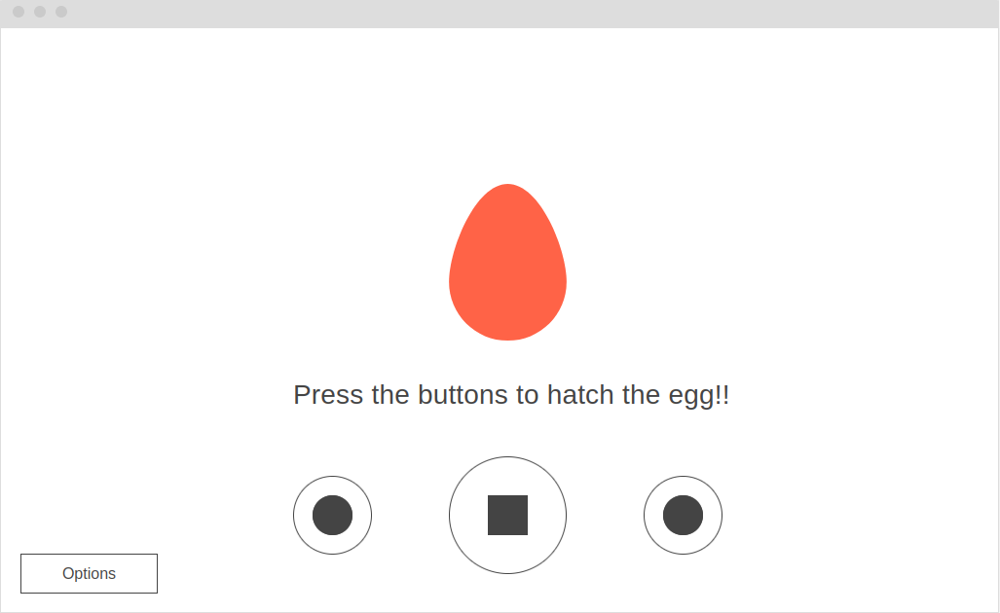
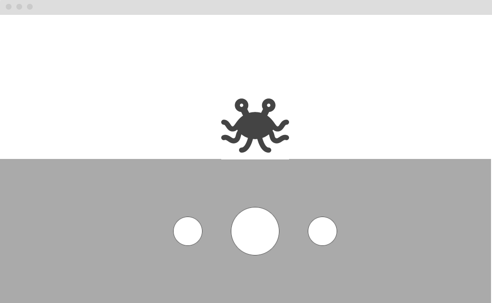
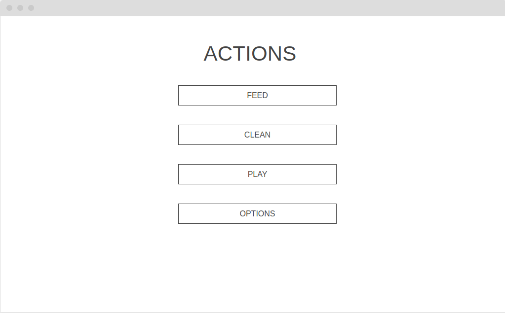
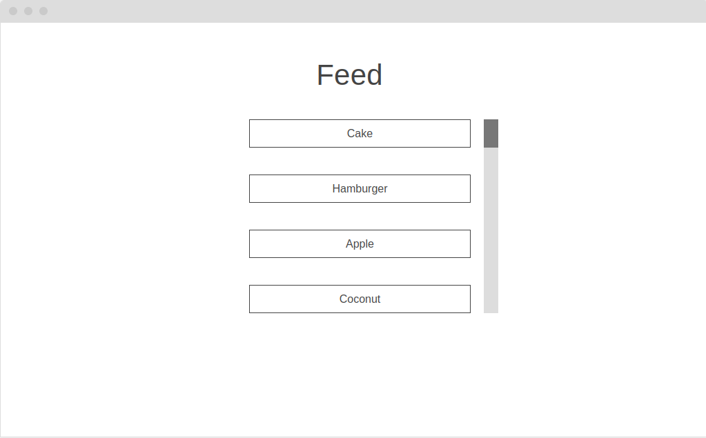
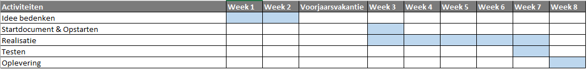

# Startdocument Threading in C# - Tamagotchi

Startdocument van **Nikita Hoogeveen**, **Robin van Dijk**, **Nick Buisman** en **Chris Klunder**.

## Applicatie Beschrijving

Het idee voor threading in C# is het maken van een soortgelijke applicatie aan Tamagotchi. Tamagotchi is een soort spel waarin de gebruiker een virtueel huisdier heeft. Dit huisdier kan verzorgd worden en er kan mee worden gespeeld. Voor verdere informatie over Tamagotchi, zie de literatuurlijst (Tokyo.nl, 2023).

De applicatie zal ontwikkeld worden met **.NET MAUI 8.0** (Davidbritch, 2023) in **Visual Studio 2022**.

---

## Requirements

De requirements zullen worden vastgesteld doormiddel van de MoSCoW-methode. Door het gebruik van de methode, kan de groep de functies analyseren en prioriteren op de volgende manier.

### Must Have:

In de eerste instantie zijn er **Must-Haves**. Deze zijn van belang voor het product zelf, zodat het uberhaupt kan functioneren.

### Should Have:

Ten tweede zijn er de **Should-Haves**. Deze zijn niet van belang voor het product, maar zijn nog steeds redelijk belangrijk.
Het hoofddoel van een **Should** is dat het in het product zou moeten zitten, maar is niet essentieel voor het laten van het product.

### Could Have:

Ten derde zijn er de **Could-Haves**. Deze zijn niet van belang of essentieel voor het product, het is meer een optie voor de puntjes op de i als een extra.

### Won't Have:

Als laatste zijn er **Won't-Haves**. Deze zoals de naam aangeeft, zullen niet worden geïmplementeerd in het product.

| Must                                                                                                       | Should                                                  | Could                                                   | Won't     |
| ---------------------------------------------------------------------------------------------------------- | ------------------------------------------------------- | ------------------------------------------------------- | --------- |
| Aanmaken van een nieuwe Tamagotchi                                                                         | Eigen naam kiezen voor Tamagotchi                       | Mini-games                                              | Animaties |
| Inladen van een Tamagotchi bestand                                                                         | Volume van het spel aanpassen                           | Aan kunnen passen van een Tamagotchi                    |           |
| Evelueren van een Tamagotchi, van ei naar Tamagotchi                                                       |                                                         | Statistieken van Tamagotchi in kunnen zien in grafieken |           |
| Tamagotchi maakt geluid                                                                                    | Tamagotchi heeft een slaapritme                         |                                                         |           |
| Tamagotchi beweegt                                                                                         | Verschillende achtergronden voor Tamagotchi's           |                                                         |           |
| Tamagotchi kan gevoerd worden                                                                              | Verschilldende achtergronden voor verschilldende acties |                                                         |           |
| Tamagotchi kan spelen                                                                                      | Per actie zijn er verschillende keuzes                  |                                                         |           |
| Tamagotchi kan verzorgd worden                                                                             |                                                         |                                                         |           |
| Statistieken zoals voeding, gezondheid en blijheid veranderen afhankelijk van acties die worden uitgevoerd |                                                         |                                                         |           |
| Keuzens uit 5 verschillende Tamagotchi's                                                                   |                                                         |                                                         |           |
| Een overzicht van alle Tamagotchi die je hebt                                                              |                                                         |                                                         |           |
---

## Lay-out

Wanneer de applicatie opstart krijgt de gebruiker dit scherm te zien. Vanaf dit scherm kan de gebruiker kiezen uit 4 opties:

- New: Het aanmaken van een nieuw spel, de gebruik zal worden doorgestuurd naar het aanmaak scherm.
- Load: De gebruiker wordt door gestuurd naar het load scherm, hier kan een opgeslagen spel gekozen worden of een bestand worden ingeladen.
- Options: De gebruiker wordt door gestuurd naar het options scherm. Hier kan het volume van de applicatie worden aangepast.
- Exit: De applicatie wordt afgesloten.

Op dit scherm maakt de gebruiker een nieuw spel aan. Dat betekent dat de gebruiker een ei mag kiezen, door middel van de pijlen naast het ei kan de gebruiker alle eieren bekijken. Onder het ei staat het monster dat er in het ei zit. In de rechter kolom staat de persoonlijkheid, type en extra informatie over het monster. 
In het tekst veld vult de gebruiker de naam van het monster in.

Op dit scherm zijn alle opgeslagen spellen te zien in de linker kolom. In de rechter kolom is een input veld voor bestanden. Hier kan de gebruiker een bestand in slepen van een spel om te laden en te spelen.

Op het opties scherm kan het volume van de muziek, knoppen en geluidseffecten aangepast worden.

Nadat de gebruiker een tijd het ei heeft verzorgd krijgt de gebruiker het hatching scherm te zien, dit is het moment dat de Tamagotchi uit het ei komt, hiermee moet geholpen worden door op de knop in het midden te drukken totdat de Tamagotchi is uitgebroken.

Dit is het basis scherm van het spel, alle acties worden uitgevoerd op dit scherm.
De achtergrond van dit scherm zal veranderen afhankelijk van de actie die wordt uitgevoerd. Ook zijn de achtergronden verschillend per Tamagotchi.

Als de gebruiker op de linker knop drukt wordt de gebruiker terug gebracht naar het normale game scherm in het geval van het uitvoeren van een actie. Als er geen actie wordt uitgevoerd wanneer de gebruiker op deze knop drukt maakt de knop alleen maar een geluid.
Wanneer de gebruiker op de middeste knop drukt is er een interactie met de Tamagotchi. De interactie is afhankelijk van de geselecteerde actie.
Als de gebruiker de rechter knop gebruikt wordt het actie scherm geopend.

Wanneer een gebruiker op de linker knop drukt krijgt de gebruiker het Actions scherm te zien. Op dut scherm zijn alle mogelijke acties te zien zoals:
- Feed: Het voeren van de Tamagotchi. De gebruiker wordt doorgestuurd naar een soort gelijk scherm met alle etens opties waaruit de gebruiker kan kiezen.
- Clean: De gebruiker wordt doorgestuurd naar een soort gelijk scherm waar de gebruiker kan kiezen uit alle verzorgings opties die er zijn voor de Tamagotchi, zoals: wassen, borsterlen, ect.
- Play: De gebruiker wordt doorgestuurd naar een soort gelijk scherm waar de gebruiker kan kiezen uit alle spel opties om met de Tamagotchi te spelen, zoals: Overgooien of rennen.
- Options: De gebruiker wordt doorgestuurd naar het opties scherm.

Hier zijn alle voedsel opties te zien wanneer de gebruik op FEED drukt in het actions scherm. De schermen voor CLEAN en PLAY zullen er hetzelfde uit zien maar dan voor opties voor die acties.

## Klassendiagram

## Testplan

In dit deel zullen de testcases worden beschreven die worden gebruikt voor het testen van de applicatie.

### Testdata

In de tabellen hieronder worden de data weergegeven die nodig zijn om de applicatie te testen

## Test cases

User interactieve cases:

| Input | Verwachte resultaat | Daadwerkelijke resultaat |
| ----- | ------------------- | ------------------------ |
|       |                     | ...                      |

## Planning 

Om de voortgang van dit project te bewaken, is er een planning gemaakt. Deze planning bevat in grote lijnen hetgeen waarmee wij ons bezig zullen houden per week tot de deadline. Er kan natuurlijk afgeweken worden van deze planning, maar het is het doel om deze in grote lijnen te volgen.

Dit project is begonnen op maandag 5 februari 2024 en zal eindigen op vrijdag 5 april 2024.

## Literatuurlijst

-   Davidbritch. (2023, 25 juli). What is .NET MAUI? - .NET MAUI. Microsoft Learn. Geraadpleegd op 1 maart 2024, van https://learn.microsoft.com/en-us/dotnet/maui/what-is-maui?view=net-maui-8.0

-   Tokyo.nl. (2023, 20 september). Ontdek de Tamagotchi: Japans nostalgische icon - Tokyo.nl. Geraadpleegd op 1 maart 2024, van https://tokyo.nl/japan/japanse-cultuur/tamagotchi/
